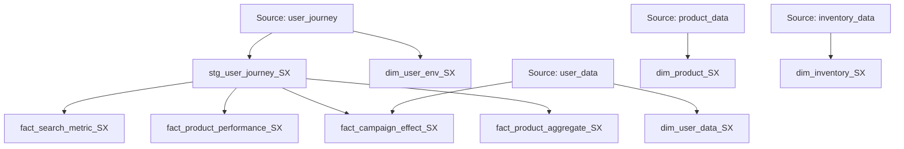

# Retail Analytics Data Modelling

**Snowflake · dbt Core · SQL · Data quality**

A retail analytics transformation project that turns user journeys, product details, customer attributes, and inventory records into focused reporting models. The repository contains **nine dbt models**: one staging model, four dimensions, and four fact/aggregate models.

The models support questions such as: Which products attract engagement? Which search experiences lead to purchase-flagged interactions? How do campaign-tagged interactions vary among customers who opted into marketing?

## Start here

- **Understand the flow:** explore the lineage diagram below.
- **Review the SQL:** start with [user journey staging](models/data_mart/stg_user_journey_SX.sql), then the [daily product aggregate](models/data_mart/fact_product_aggregate_SX.sql).
- **Inspect the design:** read the [model guide and trade-offs](docs/model-guide.md).
- **Run the project:** follow the [Snowflake setup guide](docs/setup.md).

## What the project demonstrates

| Area | Implementation |
| --- | --- |
| Reusable staging | Shared event fields and hour/day buckets feed downstream facts. |
| Dimensional modelling | Separate customer, product, inventory, and session-environment models. |
| Incremental processing | Five models use composite keys and exclude keys already in the target. |
| Reporting aggregates | A product/day table summarizes search, view, cart, and purchase flags. |
| Data quality | Column-level null checks, three SQL data tests, and three unit-test definitions. |
| Documentation | Source declarations, column descriptions, lineage, and explicit metric definitions. |

## Data flow

Solid arrows represent dependencies declared with `source()` or `ref()` in the SQL. Dimensions provide reporting context; fact models do not all join dimensions during their builds.



## Reporting outputs

| Model | Purpose | Interpretation |
| --- | --- | --- |
| `fact_search_metric_SX` | Search terms, configuration, result counts, and engagement flags | Product-level search interactions; rows are not necessarily distinct searches. |
| `fact_product_performance_SX` | Quick-view, detail-page, add-to-cart, and purchase flags | Supports analysis of engagement patterns across products. |
| `fact_campaign_effect_SX` | Campaign/source/medium attributes for opted-in users | Descriptive campaign analysis; does not calculate ROI or causal lift. |
| `fact_product_aggregate_SX` | Daily product engagement counts | `amount_sold` counts purchase-flagged records, not units sold or revenue. |
| `dim_inventory_SX` | Stock quantities, demand, and restock attributes | Current inventory context; no historical stock snapshots or turnover calculation. |

See the [model guide](docs/model-guide.md) for all grains, keys, metric definitions, and limitations.

## Quality checks

The repository includes three complementary forms of testing:

- **Column tests:** `not_null` checks on selected identifiers, timestamps, attributes, and aggregate measures in [schema.yml](models/data_mart/schema.yml).
- **SQL data tests:** [user references](data-tests/invalid_user_id.sql), [marketing opt-in](data-tests/marketing_option_test.sql), and a [basic email-format check](data-tests/test_valid_email.sql).
- **Unit-test fixtures:** [timestamp bucketing](models/stg_user_journey_test.yml), [campaign filtering](models/fact_campaign_effect_test.yml), and [daily aggregation](models/fact_product_aggregate_test.yml).

These are test definitions, not a claim of a currently passing warehouse run. Existing fixtures exercise the full-build logic; incremental reruns and late updates need additional coverage.

## Run locally

The four source tables must already exist in Snowflake. The bundled `brave_data/` CSVs are separate starter datasets and do not populate those sources.

1. Install dbt Core and the Snowflake adapter in an isolated Python environment.
2. Copy [profiles.example.yml](profiles.example.yml) to a local, ignored `profiles.yml` and supply credentials through environment variables.
3. Install dbt packages, check the connection, and build in your development schema:

```bash
dbt deps
dbt debug --profiles-dir .
dbt build --profiles-dir .
```

Read [setup.md](docs/setup.md) first for source requirements, dependency notes, and schema behavior.

## Repository map

| Path | Contents |
| --- | --- |
| [`models/raw_data/`](models/raw_data/) | Snowflake source declarations; these do not create or load raw tables. |
| [`models/data_mart/`](models/data_mart/) | Staging, dimension, fact, and aggregate SQL plus column documentation. |
| [`models/`](models/) | Unit-test YAML alongside the model directories. |
| [`data-tests/`](data-tests/) | SQL assertions returning failing records. |
| [`macros/`](macros/) | Helper macros, including target-schema naming behavior. |
| [`docs/`](docs/) | Setup instructions and modelling decisions. |
| [`brave_data/`](brave_data/) | Starter CSVs, separate from the active source model. |
| [`.github/workflows/`](.github/workflows/) | Existing dbt Cloud workflow templates; require separately configured jobs. |

## Scope and next steps

This repository presents the **warehouse transformation and testing layer**. Extraction/loading scripts, Airflow DAGs, Power BI reports, and measured business results are not included here.

The current incremental predicates admit unseen keys, but skip corrections to existing keys. The next modelling priorities are deterministic deduplication, explicit grain validation, late-update handling, and incremental test coverage. Details are recorded in the [model guide](docs/model-guide.md#design-trade-offs-and-next-steps).

## Project background

Developed from the BRAVE Data Engineer project structure. The final dbt models, tests, and pipeline implementation were completed in my own project branch. Starter assets and workflow scaffolding are retained with their role identified above.

Original course setup reference: [BRAVE Data Engineering Project Setup — Weeks 3 & 4](https://docs.google.com/document/d/1DFNScaTC8S_AXgw0ffgOOm7rlzkycdTRpRIZtF_qtrw). The local setup guide documents this repository's requirements without relying on access to that document.
